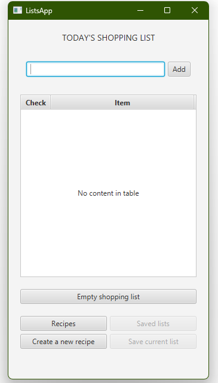
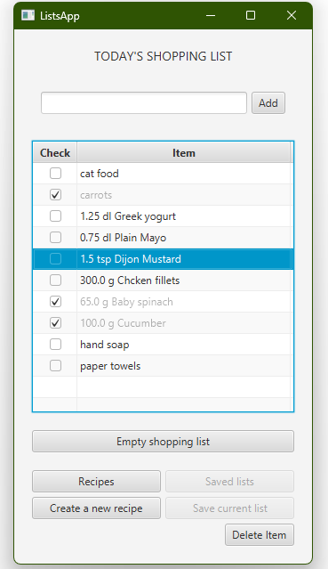
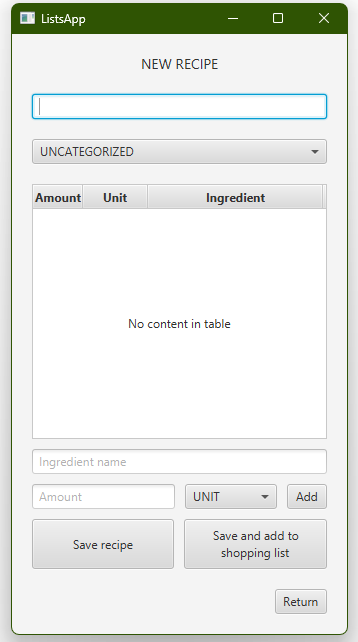
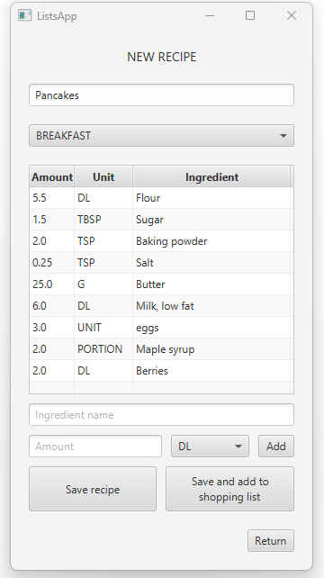
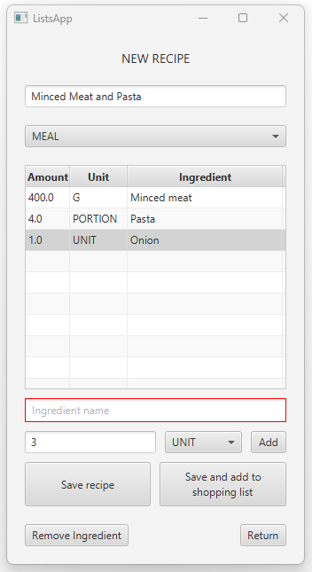
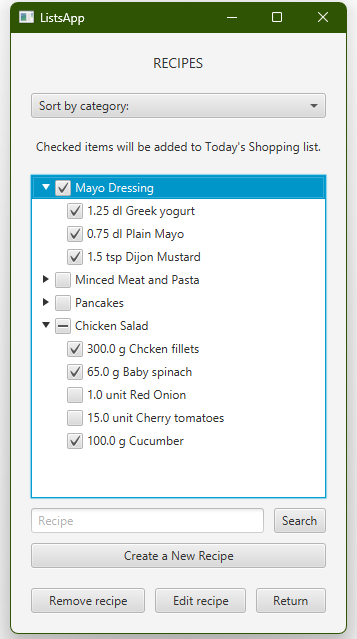
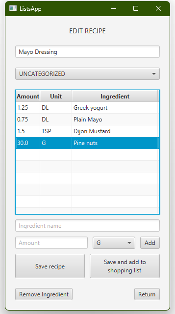

# ListsApp

This project is an exercise assignment for the Programming 2 (Object-Oriented Programming)
course at the University of Jyväskylä. The application is developed using Java, JavaFX, and SceneBuilder.

The application is a simple tool designed to make grocery shopping list creation easier.
Users can create and save grocery lists for specific recipes and quickly add them to a daily shopping list. 
The program will also support creating and saving custom lists for other personal needs in the future.  

## App features

### Main View:  
   

Main view features the shopping list. Latest state of the list is shown here when the App is opened.
- New items can be added on the list with text field input and the Add button (or pressing enter). 
  - Entries with no text will not be added and extra space is trimmed. 
  - Ingredients added to list from Recipes and from recipe creation show also ingredient's amount and unit of measure. 
- Checking a checkbox will change the item's status to completed, which is show visually by dimming item's text.
- Each item can be deleted from the list by selecting it, which makes the delete -button visible. Clicking empty row clears the selection.
- The whole shopping list can be emptied with single button.  

Navigation to Recipes -view and New Recipe creation is by designated buttons.  
*'Saved lists' and 'Save current list' -buttons are disabled as their features are yet to be developed.*

### New Recipe Creation
  

This scene allows user to create and save new recipes. 
- Saving new recipe requires Title and at least one ingredient. 
  - If either are missing, it's shown by outlining the element in question with red borders. 
- Recipes have a category property with options from drop-down menu:
  - meal, dessert, breakfast, snack and uncategorized(by default).
- Adding ingredients to the list happens by name, amount and unit of measure input. 
  - Unit of measure is chosen from drop-down menu with options: g, kg, dl, l, tbsp, tsp, portion and unit as the default option. 
  - Ingredient needs amount (as integer or decimal number) and a name to be included on the list, missing
  information is highlighted with red outlines.
- Selecting an already added ingredient from the list makes remove-button visible for removing selected ingredient from the list. Clicking empty row clears selection.
- 'Save recipe' -button saves the recipe and clears the scene for a new recipe creation.
- 'Save and add to shopping list' -button saves the recipe and returns to Main view. Ingredients from this recipe are added to the shopping list.
- 'Return' -button returns to Main view without saving content's from this scene.

### Recipes

Scene for viewing saved recipes in a tree view.
- Recipe title as branch and ingredients as leaves.
- Selecting a checkbox from branch selects all leaf checkboxes. Leaf checkboxes can be selected individually.
- Selected ingredients are added to Main view's shopping list
- User can search recipes or ingredients with text field input.
  - Branches with no match will be collapsed
  - Branches with match will be expanded
- Selecting a recipe un-disables remove and edit -buttons, for removing or editing chosen recipe.
- 'Create a New Recipe' -button opens scene for new recipe creation
- 'Return' -button returns to Main view
- *Sorting recipes by category feature not yet developed*

### Edit Recipe view
  

This scene has similar basic functionalities as the scene for creating new recipes.
- Opens with contents filled by chosen recipe's information
- All features of the recipe can be edited. Ingredients can be removed and new ones added.
- 'Save recipe' -button saves recipe and returns to Recipe view.
- 'Save and add to shopping list' -button saves recipe and returns to Main view and adds recipe's ingredients to shopping list.
- 'Return' -button returns to Recipe view without saving any changes.
