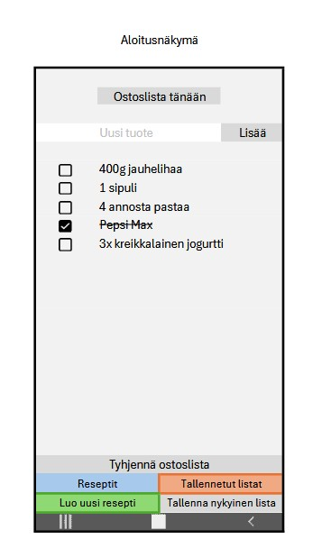
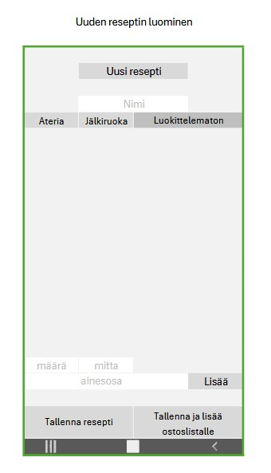
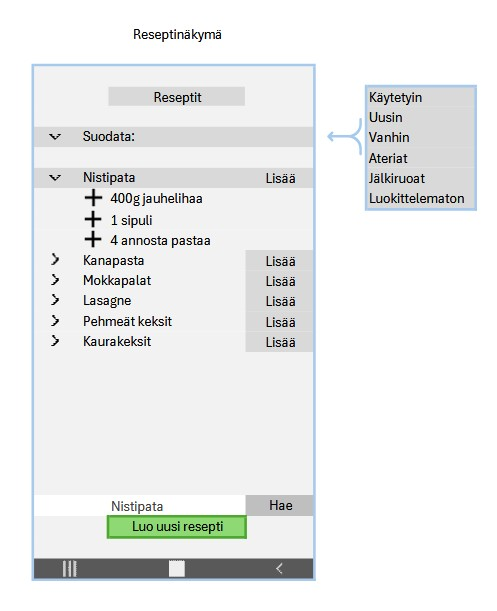
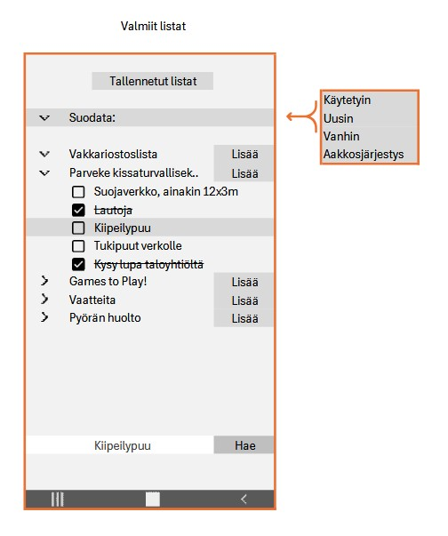

# Käyttöliittymän suunnitelma

## Näkymä 1

**Olennaiset toiminnot**

- Sovelluksen avautuessa käyttäjä näkee päivän ostoslistan. Jos sellaista ei ole tehty, lista on tyhjä.
- Näkymässä on mahdollista lisätä syötteellä yksittäisiä tuotteita listalle.
- Tuotteen vieressä on valintaruutu, jonka valitseminen yliviivaa kyseisen tuotteen tekstin.
- Näkymään pääsee avaamalla sovelluksen tai palaamalla muista näkymistä peruutuspainikkeella.
- Mitä käyttäjä voi tehdä käyttöliittymässä:
  - Lisätä listalle yksittäisiä tuotteita (TextField + Button)
  - Poistaa yksittäisiä listalla jo olevia tuotteita (Button)
  - Yliviivata/perua yliviivaus valintaruudulla (CheckBox)
  - Tyhjentää näkymään luotu lista (Button)
  - Tallentaa näkymään luotu lista (Button) (Jos jää aikaa, muuten omalla ajalla)
  - Siirtyä katselemaan tallennettuja reseptejä (Button)
  - Siirtyä katselemaan tallennettuja listoja (Button) (Jos jää aikaa, muuten omalla ajalla)
  - Siirtyä luomaan uutta reseptiä (Button)
  - Sulkea sovelluksen (tietokoneella ikkunan sulkeminen, mobiilissa peruutus/kotinäyttö)

## Näkymä 2

**Olennaiset toiminnot**

- Näkymässä selkeä käyttötarkoitusta tukeva otsikointi.
- Tekstikentät reseptin nimelle ylhäällä, alhaalla ainesosan nimelle.
- Alhaalla myös tekstikenttä ainesosan määrälle ja pudotusvalikko mitta-asteikolle (Muistettava parse ja syötteen poikkeusvirheet!)
- Näkymään pääsee:
  - aloitusnäkymästä painamalla painiketta
  - tallennettujen reseptien näkymästä painamalla "luo uusi resepti" painiketta
  - tallennettujen reseptien näkymästä painamalla "muokkaa reseptiä" painiketta
- Mitä käyttäjä voi tehdä käyttöliittymässä:
  - Nimetä reseptin (TextField)
  - Luokitella reseptin (Ateria/Jälkiruoka/Luokittelematon)
  - Nimetä yksittäisen ainesosan (TextField), kirjata tarvittavam määrän (TextField), valita mitta-asteikon (ComboBox)
    - Lisäys reseptille lisää -painikkeella (Button)(Validointi, yllämainitut pakollisia tietoja)
  - Tallentaa luodun reseptin (Button)(Validointi, nimi ja vähintään 1 ainesosa)
  - Tallentaa luodun reseptin, ja siirtää sen sisältö samalla päivän ostoslistalle aloitusnäkymään
  - Palata aloitusnäkymään/reseptinäkymään peruuta painikkeella

## Näkymä 3

**Olennaiset toiminnot**

- Näkymässä selkeä käyttötarkoitusta tukeva otsikointi.
- Listattuna aiemmin tallenettujen reseptien otsikot, sekä mahdollisuus avata näkyviin reseptiin kuuluvat ainesosat
- Järjestää hakutulokset uusimman, vanhimman, käytetyimmän, aakkosjärjestyksen tai luokittelun mukaan
- Alhaalla hakukenttä halutun reseptin hakua varten, sekä painike uuden reseptin luomiselle
- Näkymään pääsee:
  - aloitusnäkymästä painamalla painiketta
  - Uuden reseptin luomisen näkymästä painamalla "tallenna" painiketta
  - peruuttamalla uuden reseptin luomisen näkymästä painamalla peruuta painiketta (ei tallenna)
- Mitä käyttäjä voi tehdä käyttöliittymässä:
  - Järjestää reseptit (ComboBox)
  - Lisätä kokonaisen reseptin ainesosat yhdellä klikkauksella päivän ostoslistalle aloitusnäkymään (Button)
  - Avata yksittäisen reseptin ainesosaluettelo (klikkaus)
    - Lisätä tai poistaa yksittäisen ainesosan päivän ostoslistalle (klikkaus)
    - Päivän ostoslistalle siirtyy ainesosan määrä x yksittäisten klikkausten määrä. Poistaminen samalla logiikalla.
    - Näkymässä ainesosan määrä kasvaa, muttei tallennu
  - Muokata olemassa olevaa reseptiä (Button)
    - Avaa Reseptin luomis näkymän, mutta siirtää reseptin tiedot sinne valmiiksi
  - Poistaa reseptin (Button)
  - Hakea reseptiä (TextField + Button)
  - Siirtyä luomaan uutta reseptiä (Button)
  - Peruuttaa aloitusnäkymään peruuta painikkeella

## Näkymä 4 (Jos jää aikaa, muuten omalla ajalla kurssin jälkeen)

**Olennaiset toiminnot**

  - Saman kaltaiset ominaisuudet reseptinäkymän kanssa
    - Lisäksi valintaruutu, joka yliviivaa/poistaa yliviivauksen tuotteelta
      - Tallentuu
      - Jos tuote yliviivataan aloitusnäkymässä, se tallentuu myös
  - Näkymään pääsee:
    - aloitusnäkymästä painamalla painiketta
  - Mitä käyttäjä voi tehdä käyttöliittymässä:
    - Järjestää Listat (Käytetyin, uusin, vanhin, aakkosjärjestys) (ComboBox)
    - Lisätä koko Listan yhdellä klikkauksella päivän ostoslistalle aloitusnäkymään (Button)
    - Avata yksittäisen Listan tuoteluettelon (klikkaus)
      - Lisätä tai poistaa yksittäisen tuotteen päivän ostoslistalle (klikkaus)
      - Yliviivata/poistaa yliviivauksen tuotteelta (CheckBox)
    - Hakea syötettä vastaavaa tekstiä Listoista (TextField + Button)
    - Peruuttaa aloitusnäkymään peruuta painikkeella